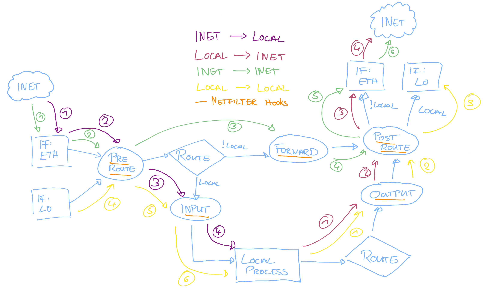

# nftables

[Nftables][nftables] is a stateful Linux firewall which uses the
[netfilter][netfilter] kernel hooks.
It is used for stateless, stateful packet filtering and all sorts of NAT.

Nftables is the successor to [iptables][iptabes].

In nftables, `rules` are organized with `chains` and `tables`.
- `chain`: Orders `rules`. Chains exist in two kinds:
    - `base chain`: Entry point from netfilter hooks (network stack).
    - `regular chain`: Can be used as jump target to group rules for better organization.
- `table`: Groups chains together. Tables are defined by a `name` and an
  `address family` (eg `inet`, `ip`, `ip6`, ..).

## Ruleset
```bash
nft list ruleset        # List all tables/chains/rules (whole ruleset).
nft flush ruleset       # Clear whole ruleset.
```

## Examples: Save rules to files and re-apply
```bash
nft list ruleset > nft.rules
nft flush ruleset
nft -f nft.rules
```

## Example: Fully trace evaluation of nftables rules
```text
table ip traceall {
    chain filter_prerouting {
        # Install chain with higher priority as the RAW standard priority.
        type filter hook prerouting priority raw - 50; policy accept;
        # Trace each and every packet (very verbose).
        #meta nftrace set 1;
        # Trace packet to port 80/81/8081 from localhost.
        tcp dport { 80, 81, 8081 } ip saddr 127.0.0.1 meta nftrace set 1;
    }
}
```

Use `nft monitor trace` to get trace output on tty.

## Example: IPv4 port forwarding
```text
table ip fwd {
    chain nat_preroute {
        # Register this chain to the PREROUTE:NAT hook (stateful packet tracking via conntrack).
        type nat hook prerouting priority dstnat + 10 ; policy accept;
        meta nfproto ipv4 tcp dport 81 redirect to :8081
    }
}
```

## Example: Base vs regular chain
```text
# Table named 'playground' handling 'ip' (ipv4) address family.
table ip playground {
    # Base chain.
    chain filter_input_base {
        # Register this chain to the INPUT:FILTER hook in the netfilter package flow.
        # Specify a prioirty relative to the inbuilt 'filter' priority (smaller
        # number means higher priority).
        # Set the default policy to ACCEPT, to let every packet pass by default.
        type filter hook input priority filter - 10; policy accept;

        # Create a rule for tcp packets arriving on either port 8000 or 8100.
        tcp dport { 8000, 8100 } jump input_reg_log;
        # Create a rule for tcp packets arriving on port 8200.
        tcp dport 8200 jump input_reg_log_all;
    }

    # Regular chain.
    chain input_reg_log {
        # Log every packet traversing this chain.
        # Message lands in the kernel ring buffer.
        log;
    }

    # Regular chain.
    chain input_reg_log_all {
        # Log every packet with all flags traversing this chain.
        log flags all;
    }
}
```

```bash
# Load the nf rules.
sudo nft -f playground.rules
# Create test servers.
nc -lk 0.0.0.0 8000
nc -lk 0.0.0.0 8100
nc -lk 0.0.0.0 8200
# See the nftables logging in the kernel ring buffer.
sudo dmesg -w
# Make some client connections.
nc localhost 8000
nc localhost 8200
```

## Mental model for netfilter packet flow


[netfilter]: https://nftables.org
[nftables]: https://nftables.org/projects/nftables/index.html
[iptabes]: https://nftables.org/projects/iptables/index.html
